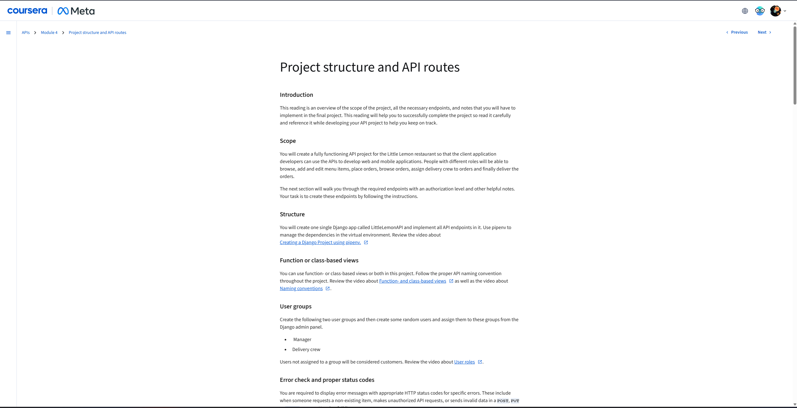

## Introduction

This project provides a comprehensive API for the Little Lemon restaurant, enabling seamless interaction for various user roles. It's designed to support web and mobile applications, allowing users to browse and manage menu items, place and track orders, and for staff to manage deliveries efficiently.


-----

## Project Structure and Setup

The API is built using Django REST Framework. All API endpoints are implemented within a single Django app named `LittleLemonAPI`.

### Prerequisites

Before running the project, ensure you have `pipenv` installed.

```bash
pip install pipenv
```

### Setup

1.  **Clone the repository:**
    ```bash
    git clone https://github.com/Samira-Gabr/LittleLemon-API-Meta.git
    cd LittleLemon-API-Meta
    ```
2.  **Navigate to the project root:**
    ```bash
    cd LittleLemon 
    ```
3.  **Install dependencies using Pipenv:**
    ```bash
    pipenv install
    ```
4.  **Activate the virtual environment:**
    ```bash
    pipenv shell
    ```
5.  **Run database migrations:**
    ```bash
    python manage.py migrate
    ```
6.  **Create a superuser (for Django Admin access):**
    ```bash
    python manage.py createsuperuser
    ```
7.  **Run the development server:**
    ```bash
    python manage.py runserver
    ```

-----

## User Roles and Authentication

The API supports different user roles, each with specific permissions. Users are categorized into:

  * **Manager**: Users assigned to the 'Manager' group.
  * **Delivery Crew**: Users assigned to the 'Delivery Crew' group.
  * **Customer**: Users not assigned to any specific group (default role).
  * **Superuser**: Django's built-in superuser, typically with full access.

**Djoser** is integrated to handle user registration and token generation, simplifying authentication flows.

### User Group Management

Create the following two user groups from the Django admin panel (`http://127.0.0.1:8000/admin/`):

  * `Manager`
  * `Delivery Crew`

Then, assign users to these groups as needed.

-----

## API Endpoints

All API endpoints are designed with appropriate authorization levels and return standardized HTTP status codes for various scenarios.

### HTTP Status Codes Guide

| HTTP Status Code | Reason                                                              |
| :--------------- | :------------------------------------------------------------------ |
| `200 - OK`       | For all successful `GET`, `PUT`, `PATCH`, and `DELETE` calls.       |
| `201 - Created`  | For all successful `POST` requests.                                 |
| `401 - Unauthorized` | If user authentication fails (e.g., invalid token).             |
| `403 - Forbidden` | If authorization fails for the current user token (permission denied for action). |
| `400 - Bad Request` | If validation fails for `POST`, `PUT`, `PATCH`, and `DELETE` calls. |
| `404 - Not Found` | If the request was made for a non-existing resource.               |

### 1\. User Registration and Token Generation

These endpoints are provided by **Djoser**.

| Endpoint               | Role             | Method | Purpose                                     |
| :--------------------- | :--------------- | :----- | :------------------------------------------ |
| `/api/users`           | No role required | `POST` | Creates a new user (username, email, password). |
| `/api/users/me/`       | Authenticated User | `GET`  | Displays details of the current authenticated user. |
| `/token/login/`        | Authenticated User | `POST` | Generates access tokens for authenticated users. |

-----

### 2\. Menu Items Endpoints

#### For Customers & Delivery Crew

| Endpoint                    | Role                  | Method                 | Purpose                                   |
| :-------------------------- | :-------------------- | :--------------------- | :---------------------------------------- |
| `/api/menu-items`           | Customer, Delivery Crew | `GET`                  | Lists all menu items (`200 - OK`).        |
| `/api/menu-items`           | Customer, Delivery Crew | `POST`, `PUT`, `PATCH`, `DELETE` | Denies access (`403 - Forbidden`).        |
| `/api/menu-items/{menuItem}`| Customer, Delivery Crew | `GET`                  | Lists a single menu item (`200 - OK`).    |
| `/api/menu-items/{menuItem}`| Customer, Delivery Crew | `POST`, `PUT`, `PATCH`, `DELETE` | Denies access (`403 - Forbidden`).        |

#### For Managers

| Endpoint                    | Role    | Method                 | Purpose                                         |
| :-------------------------- | :------ | :--------------------- | :---------------------------------------------- |
| `/api/menu-items`           | Manager | `GET`                  | Lists all menu items (`200 - OK`).              |
| `/api/menu-items`           | Manager | `POST`                 | Creates a new menu item (`201 - Created`).      |
| `/api/menu-items/{menuItem}`| Manager | `GET`                  | Lists a single menu item (`200 - OK`).          |
| `/api/menu-items/{menuItem}`| Manager | `PUT`, `PATCH`         | Updates a single menu item (`200 - OK`).        |
| `/api/menu-items/{menuItem}`| Manager | `DELETE`               | Deletes a menu item (`200 - OK`).               |

-----

### 3\. User Group Management Endpoints (Manager Only)

| Endpoint                           | Role    | Method   | Purpose                                                                                                                             |
| :--------------------------------- | :------ | :------- | :---------------------------------------------------------------------------------------------------------------------------------- |
| `/api/groups/manager/users`        | Manager | `GET`    | Returns all users in the 'Manager' group (`200 - OK`).                                                                              |
| `/api/groups/manager/users`        | Manager | `POST`   | Assigns the user specified in the payload to the 'Manager' group (`201 - Created`). Requires `username` in payload.                  |
| `/api/groups/manager/users/{userId}` | Manager | `DELETE` | Removes the specified user from the 'Manager' group (`200 - OK`). Returns `404 - Not Found` if the user is not found.            |
| `/api/groups/delivery-crew/users`  | Manager | `GET`    | Returns all users in the 'Delivery Crew' group (`200 - OK`).                                                                        |
| `/api/groups/delivery-crew/users`  | Manager | `POST`   | Assigns the user specified in the payload to the 'Delivery Crew' group (`201 - Created`). Requires `username` in payload.           |
| `/api/groups/delivery-crew/users/{userId}` | Manager | `DELETE` | Removes the specified user from the 'Delivery Crew' group (`200 - OK`). Returns `404 - Not Found` if the user is not found. |

-----

### 4\. Cart Management Endpoints (Customer Only)

| Endpoint                  | Role     | Method   | Purpose                                                                                                                                                                                                                                                                                                                                                                                                                                                                                                                                  |
| :------------------------ | :------- | :------- | :--------------------------------------------------------------------------------------------------------------------------------------------------------------------------------------------------------------------------------------------------------------------------------------------------------------------------------------------------------------------------------------------------------------------------------------------------------------------------------------------------------------------------------------- |
| `/api/cart/menu-items`    | Customer | `GET`    | Returns all current menu items in the cart for the authenticated user (`200 - OK`).                                                                                                                                                                                                                                                                                                                                                                                                                                                     |
| `/api/cart/menu-items`    | Customer | `POST`   | Adds a menu item to the cart. Sets the authenticated user as the user ID for these cart items (`201 - Created`). If the item already exists in the cart, it increments the quantity.                                                                                                                                                                                                                                                                                                                                                           |
| `/api/cart/menu-items`    | Customer | `DELETE` | Deletes all menu items created by the current user from their cart (`204 - No Content`). This typically happens after an order is successfully placed.                                                                                                                                                                                                                                                                                                                                                                                        |

-----

### 5\. Order Management Endpoints

#### For Customers

| Endpoint            | Role     | Method | Purpose                                                                                                                                                                                                                                                                                                                                                                |
| :------------------ | :------- | :----- | :--------------------------------------------------------------------------------------------------------------------------------------------------------------------------------------------------------------------------------------------------------------------------------------------------------------------------------------------------------------------- |
| `/api/orders`       | Customer | `GET`  | Returns all orders with their associated order items created by the current user (`200 - OK`).                                                                                                                                                                                                                                                                         |
| `/api/orders`       | Customer | `POST` | Creates a new order for the current user. It moves all current cart items for the user into the `OrderItem` table, then clears the user's cart (`201 - Created`).                                                                                                                                                                                                      |
| `/api/orders/{orderId}` | Customer | `GET`  | Returns all items for the specified order ID. If the order ID does not belong to the current user, it returns an appropriate `403 - Forbidden` HTTP status code.                                                                                                                                                                                                          |
| `/api/orders/{orderId}` | Customer | `PUT`, `PATCH` | **Denies access** and returns `403 - Forbidden`. Customers cannot update orders directly. Managers and Delivery Crew have specific update permissions.                                                                                                                                                                                                                |

#### For Managers

| Endpoint            | Role    | Method           | Purpose                                                                                                                                                                                                                                                                                                                                                                                                                                                              |
| :------------------ | :------ | :--------------- | :----------------------------------------------------------------------------------------------------------------------------------------------------------------------------------------------------------------------------------------------------------------------------------------------------------------------------------------------------------------------------------------------------------------------------------------------------------- |
| `/api/orders`       | Manager | `GET`            | Returns all orders with their associated order items for all users (`200 - OK`).                                                                                                                                                                                                                                                                                                                                                                                     |
| `/api/orders/{orderId}` | Manager | `PUT`, `PATCH` | Updates the order details. Managers can set a delivery crew (`delivery_crew` field with user ID) and update the `status` field (0 for 'Out for Delivery', 1 for 'Delivered'). (`200 - OK`).                                                                                                                                                                                                                                                                                                                                                         |
| `/api/orders/{orderId}` | Manager | `DELETE`         | Deletes the specified order (`200 - OK`).                                                                                                                                                                                                                                                                                                                                                                                                                            |

#### For Delivery Crew

| Endpoint            | Role          | Method | Purpose                                                                                                                                                                                                                                                                                                                                                                                                                                                                    |
| :------------------ | :------------ | :----- | :------------------------------------------------------------------------------------------------------------------------------------------------------------------------------------------------------------------------------------------------------------------------------------------------------------------------------------------------------------------------------------------------------------------------------------------------------------------- |
| `/api/orders`       | Delivery Crew | `GET`  | Returns all orders with their associated order items that are assigned to the current delivery crew member (`200 - OK`).                                                                                                                                                                                                                                                                                                                                               |
| `/api/orders/{orderId}` | Delivery Crew | `PATCH` | Updates only the `status` of the order (`0` for 'Out for Delivery', `1` for 'Delivered'). Delivery crew cannot update any other field of the order. Any attempt to update other fields will result in `403 - Forbidden` (`200 - OK` on success).                                                                                                                                                                                                                                                                                                                               |

-----

## Additional Features

### Filtering, Pagination, and Sorting

The `/api/menu-items` and `/api/orders` endpoints support filtering, pagination, and sorting capabilities to enhance data retrieval:

  * **Filtering**: Filter results based on specific criteria (e.g., `?category=drinks`, `?status=0`).
  * **Pagination**: Control the number of results per page and navigate through pages (e.g., `?page=2&perpage=10`).
  * **Sorting**: Order results by various fields (e.g., `?ordering=price`, `?ordering=-date`).

### Throttling

API throttling is applied for both authenticated and unauthenticated users to prevent abuse and ensure fair usage of the API resources.

-----

## Contributing

Feel free to fork this project, open issues, or submit pull requests.

-----
